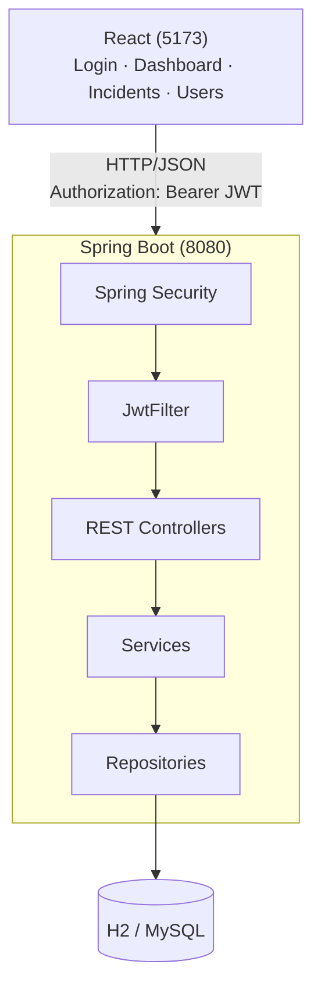
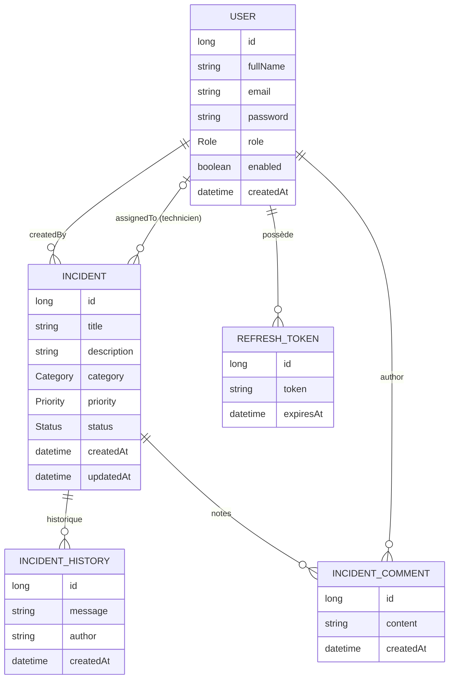

# Diagrammes

## Architecture générale

```mermaid
flowchart TD
  R["React (5173)<br/>Login · Dashboard · Incidents · Users"] -->|"HTTP/JSON<br/>Authorization: Bearer JWT"| S
  subgraph S["Spring Boot (8080)"]
    SS[Spring Security] --> F[JwtFilter] --> C[REST Controllers] --> SV[Services] --> RP[Repositories]
  end
  RP --> DB[("H2 / MySQL")]
```

## Entités

```mermaid
erDiagram
  USER ||--o{ INCIDENT : "createdBy"
  USER |o--o{ INCIDENT : "assignedTo (technicien)"
  INCIDENT ||--o{ INCIDENT_HISTORY : "historique"
  INCIDENT ||--o{ INCIDENT_COMMENT : "notes"
  USER ||--o{ INCIDENT_COMMENT : "author"
  USER ||--o{ REFRESH_TOKEN : "possède"
  USER { long id string fullName string email string password Role role boolean enabled datetime createdAt }
  INCIDENT { long id string title string description Category category Priority priority Status status datetime createdAt datetime updatedAt }
  INCIDENT_HISTORY { long id string message string author datetime createdAt }
  INCIDENT_COMMENT { long id string content datetime createdAt }
  REFRESH_TOKEN { long id string token datetime expiresAt }
```
